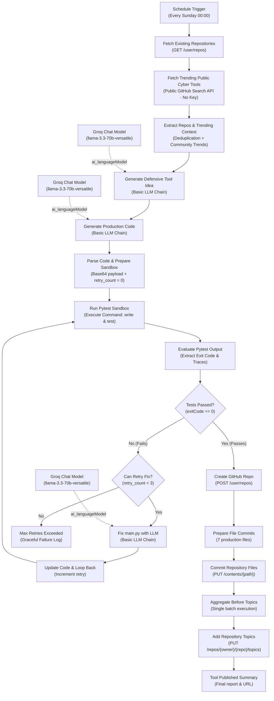

# Autonomous Tested Cyber Tool Builder & GitHub Publisher

[](https://github.com/4li466as/Autonomous-Tested-Cyber-Tool-Builder-And-GitHub-Publisher/actions/workflows/ci.yml)
[](https://n8n.io/)
[-F55036?logo=groq)](https://groq.com/)
[](https://console.groq.com/)
[](https://github.com/)
[](https://python.org/)
[](LICENSE)

An autonomous, self-healing, self-testing **n8n workflow** designed from the ground up to use **100% free and public APIs**. It conceives, implements, tests in a local sandbox, heals upon failure, and publishes production-grade Python cybersecurity and Application Security (AppSec) auditing tools directly to GitHub on a recurring schedule.

---

## Free & Public APIs Used

| Service | Type | API Endpoint / Node | Cost / Limits |
|---|---|---|---|
| **Groq Cloud** | LLM Inference | `Groq Chat Model` (`llama-3.3-70b-versatile`) | **100% Free** (Fast 300+ tok/sec, no credit card required) |
| **GitHub Search API** | Public Community Insights | `GET https://api.github.com/search/repositories` | **100% Free & Public** (No API key needed) |
| **GitHub REST API** | Repo Management & Commits | `GET /user/repos`, `POST /user/repos`, `PUT /contents` | **100% Free** (5,000 req/hour with free personal access token) |
| **PyPI Public API** | Dependency / Name Validation | `https://pypi.org/pypi/{name}/json` | **100% Free & Public** (No auth required) |

---

## Workflow Architecture



---

## Complete Node Breakdown (23 Nodes)

| Node Name | Node Type | Category | Free Tier Notes |
|---|---|---|---|
| **Schedule Trigger** | `n8n-nodes-base.scheduleTrigger` | Automation | Native n8n scheduler (runs Sundays at 00:00 UTC). |
| **Fetch Existing Repositories** | `n8n-nodes-base.httpRequest` | GitHub API | Retrieves existing repositories to guarantee zero duplicate tools. |
| **Fetch Trending Public Cyber Tools** | `n8n-nodes-base.httpRequest` | Public API | **Public Free API** (`api.github.com/search/repositories`) fetching real-time AppSec trends. No API key needed. |
| **Extract Repos & Trending Context** | `n8n-nodes-base.code` | Logic | Assembles user repos array and top trending community tools into context. |
| **Groq Model - Idea Generator** | `@n8n/n8n-nodes-langchain.lmChatGroq` | AI / LLM | Powers idea generation via `llama-3.3-70b-versatile` on Groq Free Tier. |
| **Generate Defensive Tool Idea** | `@n8n/n8n-nodes-langchain.chainLlm` | AI / Chain | Constrained strictly to defensive AppSec tooling (JWT, CSP, IAM, entropy, TLS). |
| **Groq Model - Code Generator** | `@n8n/n8n-nodes-langchain.lmChatGroq` | AI / LLM | Low-temperature Groq model for precision code generation. |
| **Generate Production Code** | `@n8n/n8n-nodes-langchain.chainLlm` | AI / Chain | Emits full codebase in structured JSON (`main.py`, `test_main.py`, `requirements.txt`, etc.). |
| **Parse Code & Prepare Sandbox** | `n8n-nodes-base.code` | Sandbox Prep | Strips markdown, validates JSON, injects MIT License and Python `.gitignore`, encodes files in Base64. |
| **Run Pytest Sandbox** | `n8n-nodes-base.executeCommand` | Local Runner | Decodes Base64 into `/tmp/builds/{repo_name}` and runs `pytest -v`. |
| **Evaluate Pytest Output** | `n8n-nodes-base.code` | Test Evaluator | Safely extracts exit codes, stdout, and tracebacks. |
| **Tests Passed?** | `n8n-nodes-base.if` | Flow Control | Checks if `test_exit_code == 0`. |
| **Can Retry Fix?** | `n8n-nodes-base.if` | Flow Control | Limits self-healing loops to 3 attempts (`retry_count < 3`). |
| **Groq Model - Fixer** | `@n8n/n8n-nodes-langchain.lmChatGroq` | AI / LLM | High-precision Groq model for diagnostic bug fixing. |
| **Fix main.py with LLM** | `@n8n/n8n-nodes-langchain.chainLlm` | Self-Healing | Diagnoses pytest failure traceback and patches `main.py`. |
| **Update Code & Loop Back** | `n8n-nodes-base.code` | Loop Re-entry | Updates code and loops back to sandbox execution. |
| **Max Retries Exceeded** | `n8n-nodes-base.code` | Safety Exit | Logs max retries reached if code cannot be healed in 3 attempts. |
| **Create GitHub Repo** | `n8n-nodes-base.httpRequest` | GitHub API | Calls `POST /user/repos` to create the public repository. |
| **Prepare File Commits** | `n8n-nodes-base.code` | Commits Prep | Prepares 7 repository files with commit messages and Base64 payloads. |
| **Commit Repository Files** | `n8n-nodes-base.httpRequest` | GitHub API | Commits files via `PUT /repos/{owner}/{repo}/contents/{path}`. |
| **Aggregate Before Topics** | `n8n-nodes-base.code` | Aggregation | Consolidates commit responses into a single execution item. |
| **Add Repository Topics** | `n8n-nodes-base.httpRequest` | GitHub API | Tags repo with `cybersecurity`, `python`, `appsec`, `security-tools`. |
| **Tool Published Summary** | `n8n-nodes-base.code` | Output | Outputs final JSON summary with repository URL and timestamp. |

---

## Getting Your Free API Keys

### 1. Groq Cloud API Key (Free, No Credit Card)
1. Go to [https://console.groq.com/keys](https://console.groq.com/keys).
2. Sign in with Google or GitHub.
3. Click **Create API Key**, give it a name (e.g., `n8n-groq`), and copy the key (starts with `gsk_`).
4. In n8n (**Credentials** > **Add Credential**):
   - Choose **Groq API**.
   - Paste the API Key.
   - Name it `Groq account`.

### 2. GitHub Personal Access Token (Free)
1. Go to [GitHub Developer Settings > Personal Access Tokens > Tokens (classic)](https://github.com/settings/tokens).
2. Click **Generate new token (classic)**.
3. Select scope:
   - `repo` (Full control of private and public repositories).
4. In n8n (**Credentials** > **Add Credential**):
   - Choose **GitHub API**.
   - Paste your token.
   - Name it `GitHub account`.

---

## Local Sandbox Prerequisites

The host machine running n8n requires Python 3.10+ and `pytest`:
```bash
# Windows
.\setup-sandbox.ps1

# Linux / macOS
bash setup-sandbox.sh
```

---

## Importing into n8n

### Via n8n CLI:
```powershell
n8n import:workflow --input="workflow.json"
```

### Via Web UI:
1. Open n8n at `http://localhost:5678`.
2. Click **Add workflow** > **Import from File**.
3. Select `workflow.json`.
4. Link your `Groq account` and `GitHub account` credentials.
5. Click **Save** and toggle the workflow to **Active**.

---

## License

Licensed under the [MIT License](LICENSE).
