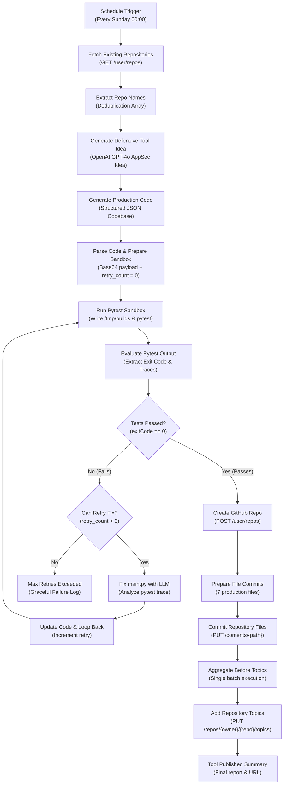

# Autonomous Tested Cyber Tool Builder & GitHub Publisher

[](https://github.com/4li466as/Autonomous-Tested-Cyber-Tool-Builder-And-GitHub-Publisher/actions/workflows/ci.yml)
[](https://n8n.io/)
[](https://python.org/)
[](LICENSE)
[](https://github.com/topics/cybersecurity)

An autonomous, self-healing, self-testing **n8n workflow** that automatically conceives, implements, tests in a local sandbox, heals upon failure, and publishes production-ready Python cybersecurity and Application Security (AppSec) auditing tools directly to GitHub on a recurring schedule.

---

## Table of Contents

- [Key Features](#key-features)
- [Workflow Architecture](#workflow-architecture)
- [Node Pipeline Walkthrough](#node-pipeline-walkthrough)
- [Autonomous Self-Healing Loop](#autonomous-self-healing-loop)
- [Published Tool Standards](#published-tool-standards)
- [Prerequisites & Setup](#prerequisites--setup)
- [Credentials Configuration](#credentials-configuration)
- [Importing into n8n](#importing-into-n8n)
- [Repository Structure](#repository-structure)
- [License](#license)

---

## Key Features

- **Automated Cron Execution**: Runs weekly (Sunday 00:00 UTC) via native n8n Schedule Trigger.
- **Intelligent Deduplication**: Queries the GitHub REST API (`GET /user/repos`) to ensure generated tools never duplicate existing repositories.
- **Defensive AppSec Focus**: Constrained to utility-focused defensive engineering (e.g., JWT analyzers, CSP header linters, IAM least-privilege checkers, entropy secret detectors, TLS compliance verifiers).
- **Zero Shell Escape Vulnerabilities**: Uses Base64-encoded file transport across nodes, preventing quotation bugs, shell injection, or cross-platform encoding mismatches.
- **Local Testing Sandbox**: Isolates each generated tool in `/tmp/builds/{repo_name}`, executes `pytest -v`, and captures exit codes, stdout, and stderr.
- **Self-Healing LLM Loop**: If `pytest` fails, stdout and stderr traces are routed to an AI fixer node that diagnoses the bug, updates `main.py`, and re-tests up to 3 automatic retries.
- **Multi-File Automated Publishing**: Commits all 7 required files (`main.py`, `tests/test_main.py`, `requirements.txt`, `README.md`, `LICENSE`, `.gitignore`, and `.github/workflows/ci.yml`) and attaches discovery topics.

---

## Workflow Architecture



---

## Node Pipeline Walkthrough

| Node Name | Node Type | Purpose |
|---|---|---|
| **Schedule Trigger** | `n8n-nodes-base.scheduleTrigger` | Triggers the workflow every Sunday at 00:00 (cron: `0 0 * * 0`). |
| **Fetch Existing Repositories** | `n8n-nodes-base.httpRequest` | Calls `GET /user/repos?per_page=100` to retrieve existing repos. |
| **Extract Repo Names** | `n8n-nodes-base.code` | Parses repo objects into a deduplication string array. |
| **Generate Defensive Tool Idea** | `@n8n/n8n-nodes-langchain.openAi` | Prompts LLM for a defensive, non-duplicate AppSec/cybersecurity tool concept. |
| **Generate Production Code** | `@n8n/n8n-nodes-langchain.openAi` | Generates a complete codebase in strict JSON (`repo_name`, `main_py`, `test_py`, `requirements_txt`, `readme_md`, `github_ci_yml`). |
| **Parse Code & Prepare Sandbox** | `n8n-nodes-base.code` | Validates JSON, injects standard `LICENSE` (MIT) & `.gitignore`, encodes files to base64, initializes `retry_count = 0`. |
| **Run Pytest Sandbox** | `n8n-nodes-base.executeCommand` | Creates `/tmp/builds/{repo_name}/tests`, writes files from base64, runs `pytest -v`, and returns JSON results. |
| **Evaluate Pytest Output** | `n8n-nodes-base.code` | Parses stdout/stderr and sets `test_exit_code`. |
| **Tests Passed?** | `n8n-nodes-base.if` | Condition check: `test_exit_code == 0`. |
| **Can Retry Fix?** | `n8n-nodes-base.if` | Condition check: `retry_count < 3`. |
| **Fix main.py with LLM** | `@n8n/n8n-nodes-langchain.openAi` | Self-healing LLM prompt with failing code and stdout/stderr failure traces. |
| **Update Code & Loop Back** | `n8n-nodes-base.code` | Updates `main_py`, increments `retry_count`, and loops back to sandbox execution. |
| **Max Retries Exceeded** | `n8n-nodes-base.code` | Graceful failure exit if tests do not pass within 3 self-healing attempts. |
| **Create GitHub Repo** | `n8n-nodes-base.httpRequest` | Calls `POST /user/repos` to create the new public repository. |
| **Prepare File Commits** | `n8n-nodes-base.code` | Prepares 7 repository files (`main.py`, `tests/test_main.py`, `requirements.txt`, `README.md`, `LICENSE`, `.gitignore`, `.github/workflows/ci.yml`). |
| **Commit Repository Files** | `n8n-nodes-base.httpRequest` | Commits each file via GitHub API (`PUT /repos/{owner}/{repo}/contents/{path}`). |
| **Aggregate Before Topics** | `n8n-nodes-base.code` | Aggregates file commit responses into a single output item. |
| **Add Repository Topics** | `n8n-nodes-base.httpRequest` | Adds topics (`cybersecurity`, `python`, `appsec`, `security-tools`) via `PUT /repos/{owner}/{repo}/topics`. |
| **Tool Published Summary** | `n8n-nodes-base.code` | Formats final JSON summary with repository URL and timestamp. |

---

## Published Tool Standards

Every repository published by this pipeline adheres to professional open-source packaging:

```text
<repo-name>/
├── .github/
│   └── workflows/
│       └── ci.yml             # GitHub Actions CI matrix
├── tests/
│   └── test_main.py           # Comprehensive pytest suite (mocked external I/O)
├── .gitignore                 # Standard Python gitignore
├── LICENSE                    # MIT License
├── README.md                  # Badges, CLI usage, architecture, and legal disclaimer
├── main.py                    # CLI script with argparse, typing, and logging
└── requirements.txt           # Pinned dependencies
```

---

## Prerequisites & Setup

### 1. Host Requirements
- **Node.js**: v18+ or v20+
- **n8n**: v1.x or v2.x (`npx n8n` or Docker)
- **Python**: v3.10+ with `pytest` installed:
  ```bash
  python -m pip install --upgrade pip pytest
  ```

### 2. Sandbox Verification
Run the included setup script:
- **Windows**: `.\setup-sandbox.ps1`
- **Linux/macOS**: `bash setup-sandbox.sh`

---

## Credentials Configuration

Configure the following credentials in your n8n web UI (**Credentials** tab):

### 1. GitHub API (`githubApi`)
- **Credential Type**: `GitHub API`
- **Name**: `GitHub account`
- **Personal Access Token (PAT)**: Create a token on GitHub with:
  - `repo` (Full control of repositories)
  - `admin:repo_hook` (Optional)

### 2. OpenAI API (`openAiApi`)
- **Credential Type**: `OpenAI API`
- **Name**: `OpenAI account`
- **API Key**: An active OpenAI API key with access to `gpt-4o` or `gpt-4o-mini`.

---

## Importing into n8n

### Option A: Via n8n CLI (Recommended)
```powershell
n8n import:workflow --input="workflow.json"
```

### Option B: Via Web UI
1. Open n8n at `http://localhost:5678`.
2. Click **Add workflow** > **Import from File**.
3. Select `workflow.json`.
4. Link your `GitHub account` and `OpenAI account` credentials.
5. Click **Save** and toggle **Active**.

---

## Docker Deployment

To run n8n with an integrated sandbox volume using Docker Compose:

```bash
docker-compose up -d
```

---

## License

This project is licensed under the [MIT License](LICENSE).
